# Product Configurations:

1.  Calm VM 3.8.1 on PC2024.2
2.  Infrastructure cluster on AOS 6.8.1.5 on PC2024.2

## What is a Project

Project is the logical construct that allowed an administrator to assign both infrastructure resources and the roles/permissions of Active Directory users/groups to specific Blueprints and Applications.

# Create a Project

1.  Login to the Calm VM using the admin user.

2.  Click on **Hamburger Menu**.  Select **Admin Center**

    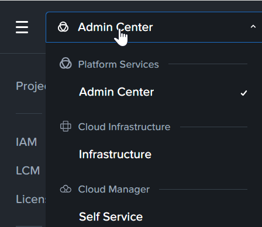

3.  Click on **Projects** 

    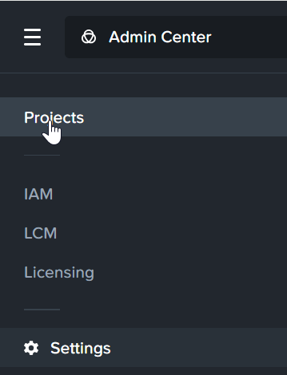

4.  Click on **Create Project**.

    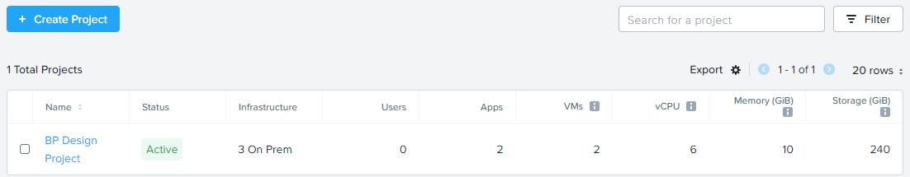

5.  Fill in the Project Name. Eg TenantProject-TraineeNo. Click on
    **Create**.

    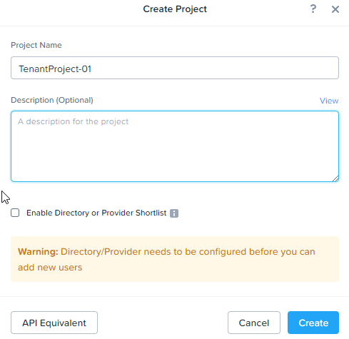

6.  This project is in the **Pending** state.  

    

## Role Based Access in Project

Both configurations (NCM Self Service VM and NCM Self Service in Prism Central) leverages on the built in roles provided in Prism Central.  These are 
the specific role available for NCM Self Service

     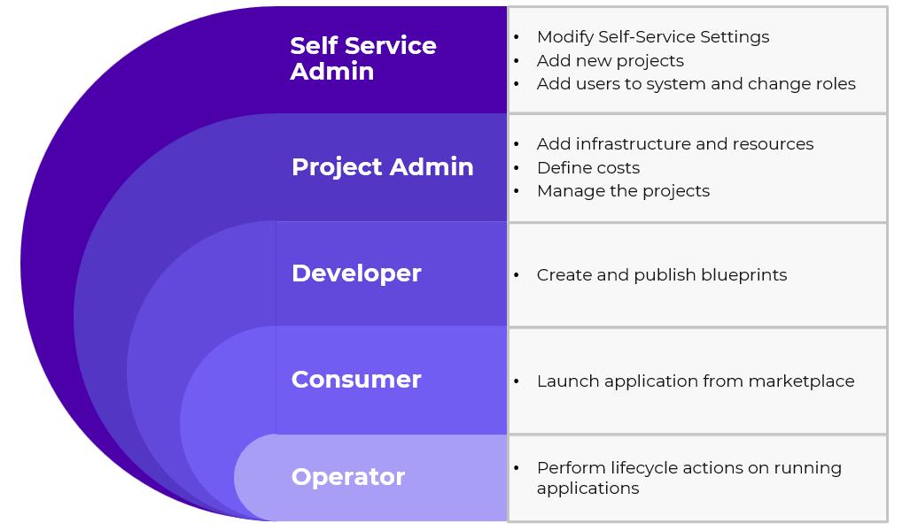

## Create user in Project

1.  Click on **Users and Groups**

    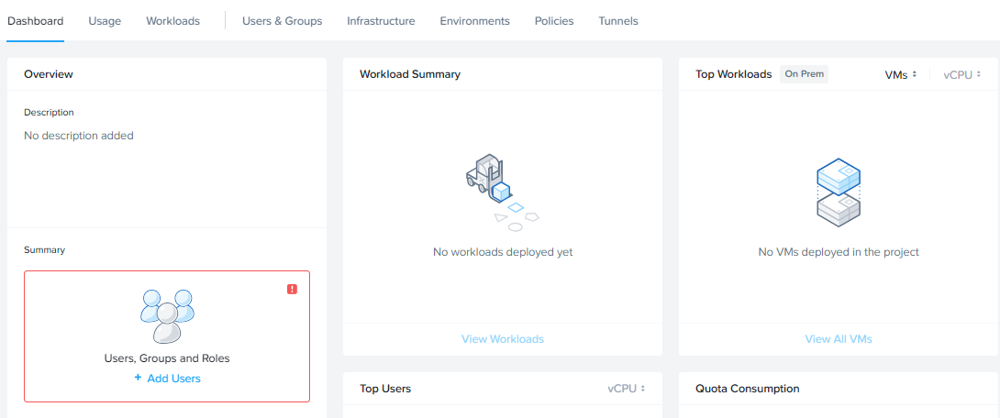

2.  Click on **Add/Edit Users and Groups**

    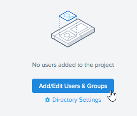

3.  Click on **+ Add User** 

    

4.  Fill in the following.  Replace **XYZ** with your trainee no

    - Name: tenant**XYZ**projadm
    - Role: Project Admin

    

5.  Add another user.  Replace **XYZ** with your trainee no

    - Name: tenant**XYZ**developer
    - Role: Consumer

    

6.  Add another user for the Blueprint Designer.  Replace **XYZ** with your trainee no

    - Name: tenant**XYZ**BPdeveloper
    - Role: Developer

    

7.  Click on **Save Users and Project**

## Add Infrastructure in Project

1.  Click on **Infrastructure**.  

2. Click on **Add Infrastructure**. Select **NTNX_LOCAL_AZ_xx** as assigned by the trainer

    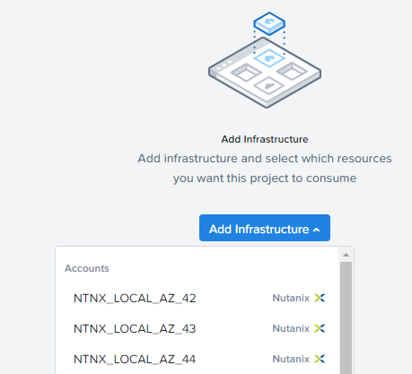

3.  Click on **Configure Resources**. 

    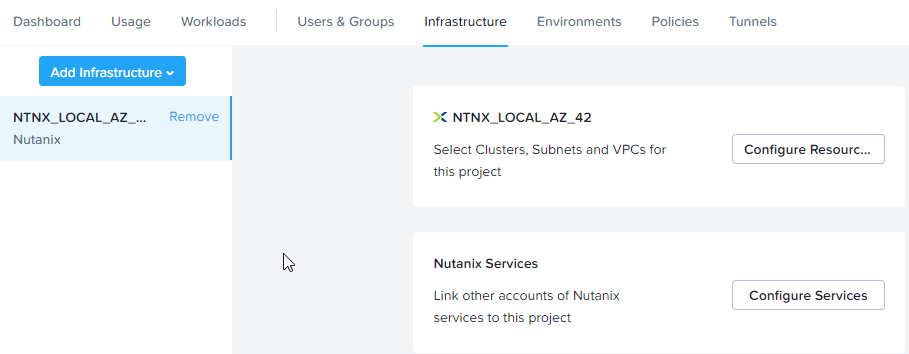

4.  Click on **Select Cluster**.  Click on **Select VLANs**

    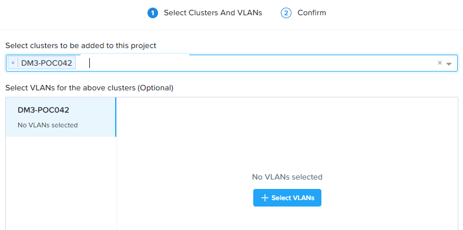

5.  Check on **Primary_xx** or **Secondary_xx** Network as assigned by the trainer.  

    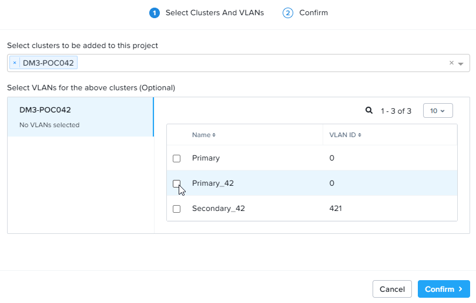

### No VPC in the cluster

1.  This section is for cluster not configured with VPC.  Please scroll down to **Configure VPC to the project** for cluster configured with VPC.

2.  Click **Confirm**

    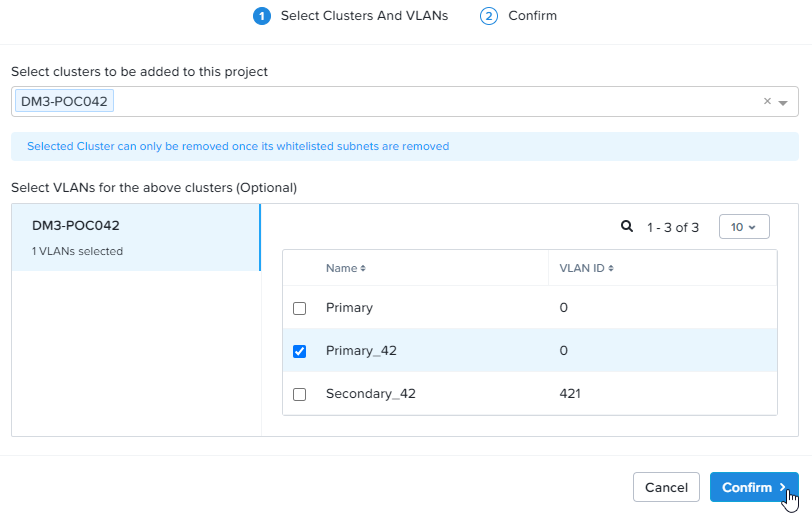

3.  Click **Confirm**

    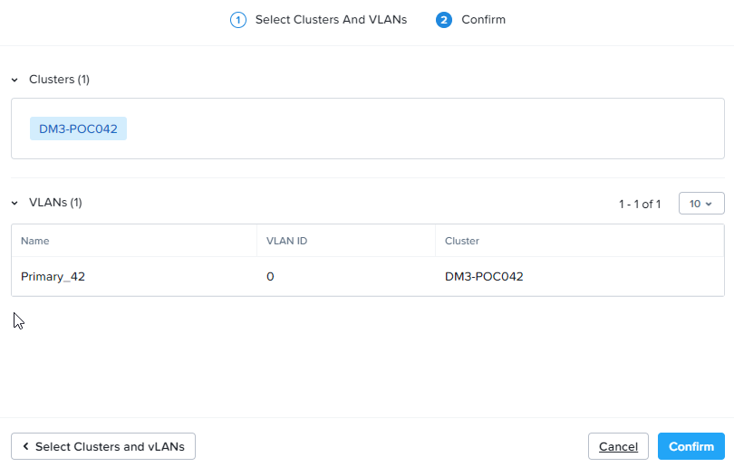

4.  Click **Save**   

    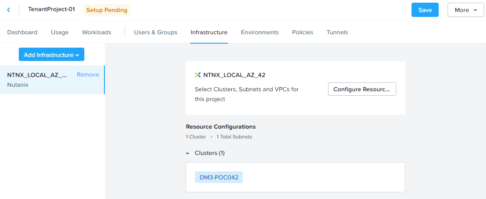

5.  The project is in the **Active** state

    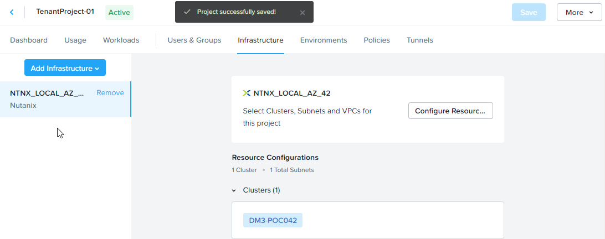

### Configure VPC to the project 

1.  This section is for cluster configured with VPC.  **Please check with the trainer**

2.  Select **VPCs & Subnets**

    

3.  Select **VPC**. Select the Overlay Subnet **SG-AMK** Network. Click
    on **Confirm**.

    

4.  Select **Confirm**.

    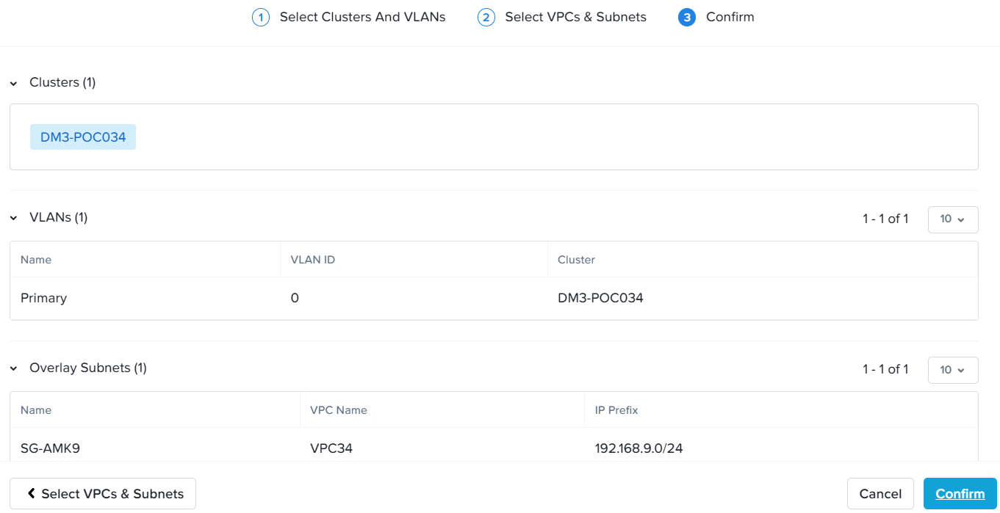

5.  Click on **Save**

    

## Configure Quota in Project

1.  Configure this section to configure the quota allocated to this project.

2.  Check the **Quotas**.  Fill in the following:

    - 100 vCPU
    - 300 GB Memory
    - 1000 GB Disk

    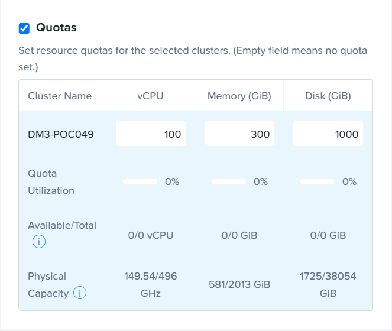

3.  Click on **Save**

