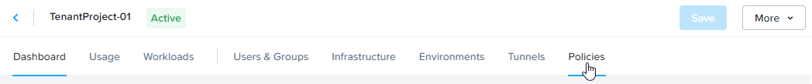
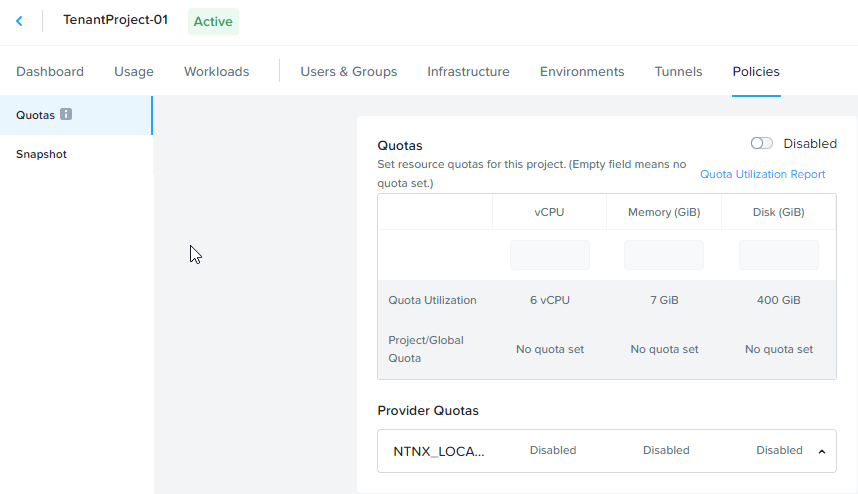
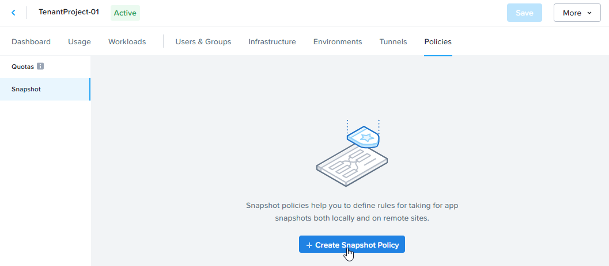
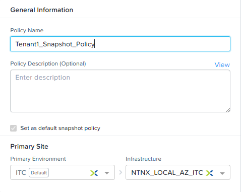
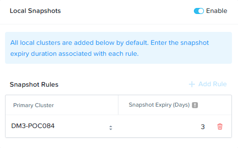
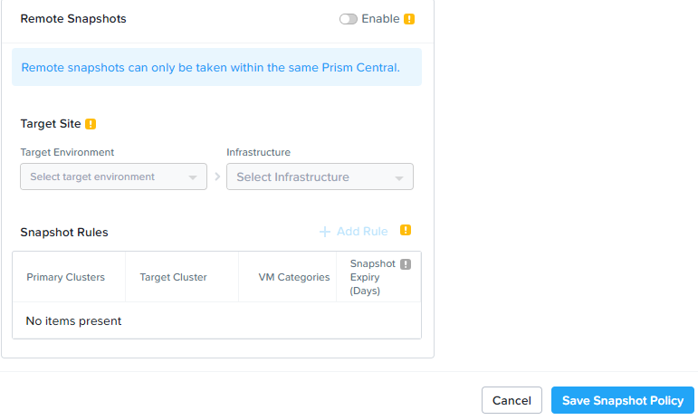
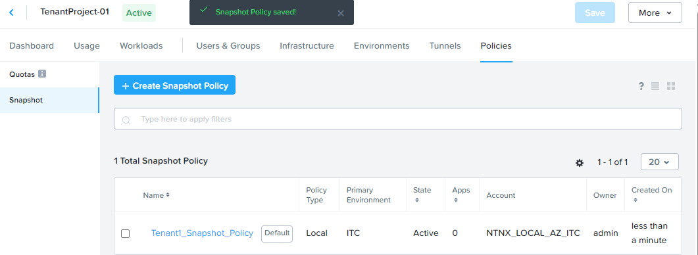

# Product Configurations:

1.  Calm VM 3.8.1 on PC2024.2
2.  Infrastructure cluster on AOS 6.8.1.5 on PC2024.2

# Snapshot Policy

The objective of the snapshot policy allows the Tenant Project Administrator to clean up the snapshots taken by the
tenant developer after the expiry period.  The Tenant Project Administrator may choose to configure the snapshot policy 
to take the snapshot locally or replicate the snapshot to a DR site for business critical Applications

# Configure Snapshot Policy in Project

1.  Click on **Policies**

    

2.  Click on **Snapshot**

    

3.  Click on **Create Snapshot Policy**

    

4.  Fill in the policy name.

    

5.  Scroll down.  Fill in the **Snapshot Expiry Day** to 3 for the **Local Snapshot Policy**

    

6.  Do not enable the **Remote Snapshot Policy**.  Click on **Save Snapshot Policy**

    

7.  The Snapshot Policy was created successfully

    

