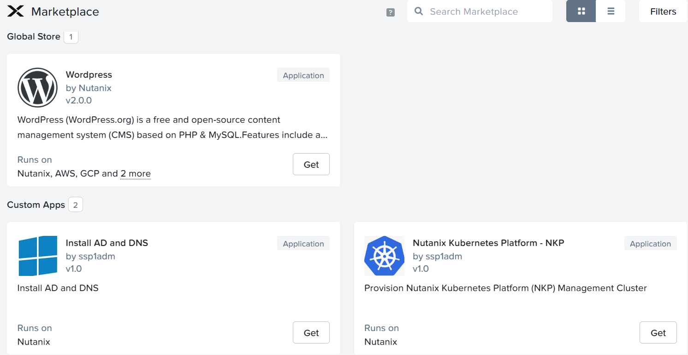

# Product Configurations:

1.  Calm VM 3.8.1 on PC2024.2
2.  Infrastructure cluster on AOS 6.8.1.5 on PC2024.2

# Overview

Nutanix Marketplace allows your developers and tenants to consume services across myraid clouds in an unified cloud
operating system.  Nutanix Marketplace allows you to congregate infrastructure providers like

- Nutanix AHV & ESXi 
- Nutanix Cloud Cluster on AWS and Azure 
- VMware VCenter ESXi on 3 tiers 
- Native AWS
- Native Azure 
- Native GCP
- Kubernetes

The Marketplace allows the system administrator to consume native Nutanix Services.

    

You can provide the underlying infrastructure as services for the developers and tenants to consume.

- EC2 or VM as a service
- ECS or Container as a service
- EKS or Kubernetes as a service (Nutanix Kubernetes Platform, OpenShift, Rancher, Google Anthos, EKS Anywhere)
- EFS or File as a service
- S3 or Object as a service
- RDS or Database as a service
- VPC or Virtual Private Cloud as a service

  

# Publishing Blueprints from Marketplace Manager

By default, NCM Self Service comes pre-seeded with validated Blueprints for multiple open source and enterprise applications. Marketplace Manager acts as a
staging area for publishing default and user-created Blueprints to your local Marketplace. The Marketplace acts as an application store,
providing end users with a catalog of available applications.

**Approach the trainer to add your project to the Wordpress Marketplace Item**

1.  Login to Calm VM as an sspadmin user.  Refer to the Google spreadsheet for the sspadmin user id.

2.  Click on hamburger menu.  Click on **Self Service**

    

3.  Click on **Marketplace Manager**

    

4. Filter by **Wordpress**

    

5.  Check on **wordpress**.  The detail popped up on the right.  Scroll down.

    

6.  Associate it with the project you had created earlier.  Click on **Apply**

    

7.  Click on **Publish**

    

# Consume Marketplace item

1.  Logout of Calm VM.  Login as tenant**XYZ**developer@ntnxlab.local user.  Replace XYZ with your assigned no.

    

2.  Click on hamburger menu.  Click on **Self Service**

    

3.  Click on **Marketplace**

    

4.  Click on **Wordpress**

    

5.  Click on **Deploy**

    

6.  Fill in the following:

    - **Application Name:** Wordpress-XYZ where XYZ is your assigned trainee no
    - **Project:** Select the project created earlier
    - **Environment:** Select the environment created earlier

   

7.  Scroll down.  Fill in the following.  Click on **Deploy**

    - **App Profile:** Nutanix
    - **WP_DB_PASSWORD:** Nutanix
    - **MYSQL_PASSWORD:** Nutanix

    

8.  Click on **View in Admin Center**

    

9.  The application is in the **Provisioning** state.  It will takes an estimated 5 to 10 minutes to 

    - Provision 1 HAProxy, 2 Apache Web Server & MySQL VM
    - Install the software in the respective VM

10.  Click on **Audit**

    

12.  Observe the audit to see the dependency in the startup.

    - MySQL service starts first.
    - Apache services starts next
    - HAProxy service start last

13.  Wait till the application is in the **Running** state

## Verification

1.  Click on **Services**

