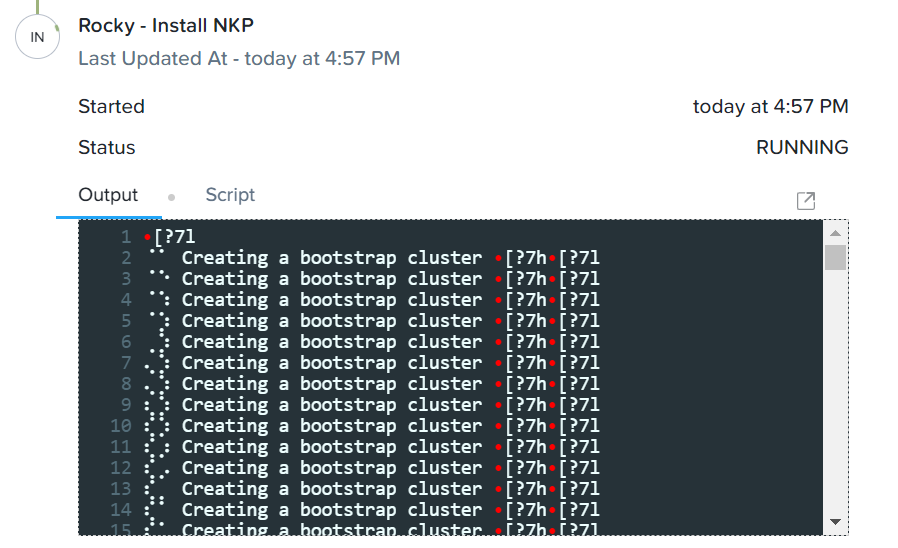
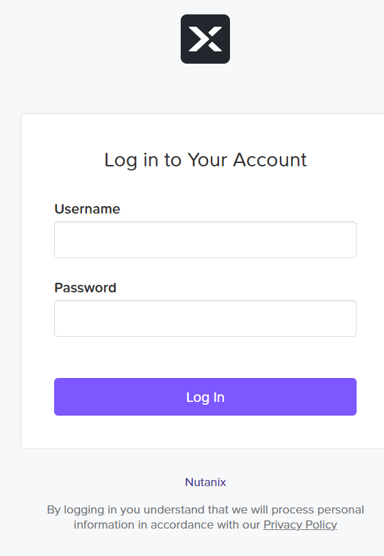

# Product configurations

1.  Calm VM 3.8.1 on PC2024.2
2.  Infrastructure cluster on AOS 6.8.1.5 on PC2024.2
3.  Nutanix Kubernetes Platform 2.12

# Associate NKP Marketplace Item to Tenant Project from Marketplace Manager

The Marketplace acts as an application store, providing end users with a catalog of available applications.

1.  Login to Calm VM as an sspadmin user.  **Refer to the Google spreadsheet for the sspadmin user id as provided by 
    the trainer**

2.  Click on hamburger menu.  Click on **Self Service**

    

3.  Click on **Marketplace Manager**

    

4. Click on **Approved**.  Filter by **nkp**

    

5.  Check on **Nutanix Kubernetes Platform (NKP)**.  The detail popped up on the right.  Scroll down.

    

6.  Associate it with the project you had created earlier.  Click on **Apply**

    

# Consume Marketplace item

The **Nutanix Kubernetes Platform (NKP)** marketplace item provisioned a bootstrap based on NKP Node OS Image 
(Rocky Linux) for AHV ( Version: 9.4-release-1.29.6-20240816215147 ) downloaded in 
https://portal.nutanix.com/page/downloads?product=nkp and started the installation of the management cluster.

1.  Logout of Calm VM.  Login as tenant**XYZ**developer@ntnxlab.local user.  Replace XYZ with your assigned no.

    

2.  Click on hamburger menu.  Click on **Self Service**

    

3.  Click on **Marketplace**

    

4.  Click on **Get** in **Nutanix Kubernetes Platform (NKP)**

    

5.  Click on **Deploy**

    

6.  Fill in the following:

    - **Application Name:** NKP-TenantXYZ where XYZ is your assigned trainee no
    - **Project:** Select the project created earlier
    - **Environment:** Select the environment created earlier

   

7.  Scroll down.  Fill in the following.  

    - **App Profile:** Default
    - **Please select the account:** Select the account to the assigned account provided by the trainer
    - **Please select the Prism Central IP:** Auto generated based on selection of account
    - **Please select the Nutanix cluster:** Auto generated based on selection of Prism Central IP
    - **Please select the subnet:** Select the subnet provided by the trainer
    
    

8.  Scroll down.  Fill in the following:

    - **Please key in the NKP Management Cluster Name:** NKP-TenantXYZ where XYZ is your assigned trainee no
    - **Please key in the NKP version:** Leave it as default
    - **Please key in the start IP of the load balancer:** Key in the IP address provided by the trainer
    - **Please key in the end IP of the load balancer:** Key in the IP address provided by the trainer
    - **Please key in the control plane VIP:** Key in the IP address provided by the trainer
    - **Please key in the registry mirror url:** Leave it as default
    
     

9.  Scroll down.  Expand the **ROCKY** credential.  This value reflect what had been configured in the environment in the project.
    Please ensure the username is **nutanix** for **ROCKY** credential

    

10. Scroll down.  Expand the **ROCKY 2 Credential** credential.  This value reflect what had been configured in the environment in the project.
    Please ensure the username is **nutanix** for **ROCKY 2 Credential ** credential

    

11.  Scroll down.  Expand the **PC Credential** credential.  This value reflect what had been configured in the environment in the project.
    Please ensure the username is **admin** for **PC Credential ** credential

    

12.  Scroll down.  Expand the **CalmVM Credential** credential.  This value reflect what had been configured in the environment in the project.
    Please ensure the username is **admin** for **CalmVM Credential ** credential

    

13.  Click on **Deploy**

14.  Click on **View in Application**

    

15.  The application is in the **Provisioning** state.  Click on **Audit**  

    
   
16.  Observe the audit.  Observe **Check Login** is successful

    

17.  Expand **Package Install**.  Expand **Install NKP Management Cluster**.  Expand **Rocky - Install NKP**.

    
   
18.  It will takes an estimated 30 to 40 minutes to complete.  Wait till the application is in the **Running** state

    

19.  Observe the audit.  Expand **Package Install**.  Expand **Install NKP Management Cluster**.  Expand **Rocky - Get User Credential**.

    

## Verification

1.  Open a new browser.  Enter the Kommander dashboard url.  Click on **Advanced**

    

2.  Click on **Proceed to x.x.x.x (unsafe)**

    

3.  Key in the credential seen in the audit. Expand **Package Install**.  Expand **Install NKP Management Cluster**.  Expand **Rocky - Get User Credential**.

    

4.  The Kommander dashboard was shown.

    