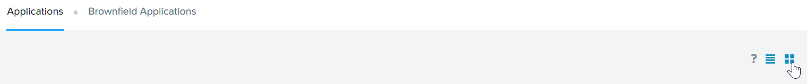

# Product configurations

1.  Calm VM 3.8.1 on PC2024.2
2.  Infrastructure cluster on AOS 6.8.1.5 on PC2024.2

# What is an Application

An application is essentially a clone of the blueprint.  It executes the tasks and actions defined in the blueprint.  

The application management functionality of Self-Service allows you to standardize and automate the entire application life cycle to ensure consistency, reduce errors, and speed up deployment times.

# My App

My Apps provides a single workspace to manage all the applications that you deployed from the Marketplace or Self-Service.

1.  Login to the Calm VM using the admin user.

2.  Click on hamburger menu.  Click on **Self Service**

    

3.  This is the list of applications available during the creation of the lab.  The list of applications will
differs from each lab.

    

3.  Click on **Tile** icon

    

4.  Look at the list of application in Tile format

    

# Manage the lifecycle of an application

NCM Self Service allows the users to manage the lifecycle of an applicationg including day 2 operations.  
Some of the days 2 operations are

1.  Tenant User changing VM specification

    

2.  Tenant User creating image or snapshot

    

3.  Tenant User scaling out Kubernetes Worker 

    

