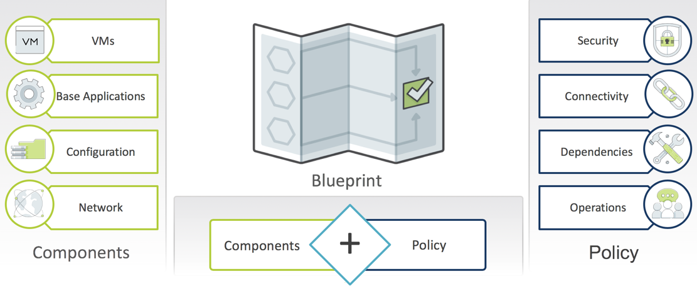
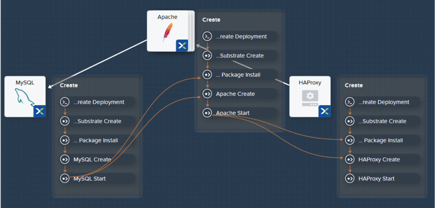
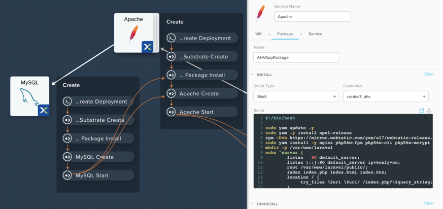
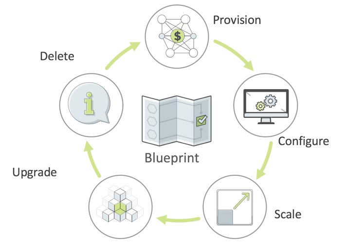
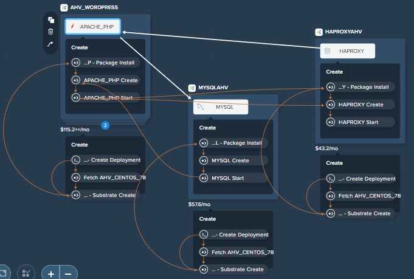

# Product configurations

1.  Calm VM 3.8.1 on PC2024.2
2.  Infrastructure cluster on AOS 6.8.1.5 on PC2024.2

# What is a Blueprints

Blueprint forms the logical design and manage the lifecycle of an application from day 0 to day 2.  
Blueprint describes all aspects from provisioning, installing an application to day 2 operation such as hardware re-sizing 
or horizontal scale out of VMs.

## Design dependencies with Application Centric Deployment

Blueprint allows the designer to make sense of complexity using visual GUI interface.  Blueprint

-   Capture organizational knowledge
-   Streamline provisioning and lifecycle tasks
-   Easy to understand dependencies

## Blueprints Are Flexible and Open

-   Utilize existing Bash or Powershell scripts
-   Call any external service using REST API

## Blueprints Are Used for Lifecycle Management

-   Automate **routine** application management operations
-   Reduce errors,delays and downtime

## Single VM Blueprint

A single-VM blueprint is a framework that you can use to create and provision an instance and launch apps that require only one virtual machine.
This model of consumption is very similar to public cloud consumption.

## Multi-VM Blueprint

A multi-VM blueprint is a framework that you can use to create an instance, provision, and launch apps that require multiple VMs.

