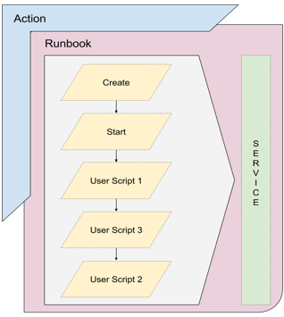

# Product configurations

1.  Calm VM 3.8.1 on PC2024.2
2.  Infrastructure cluster on AOS 6.8.1.5 on PC2024.2

# What is a Runbook

Blueprint describes all elements of an applications.  A blueprint can launch either a single VM or multi-VM application such as 
such as web, application and database.  An application manages the lifecycle within the web, application and database.

Runbook describes a series of tasks to be executed regularly across endpoints.  Both physical server or virtual machine with a 
network IP address is considered an endpoint.  Runbook can traverse across applications.  Runbooks can be hooked to a scheduler to be 
executed on a regular basis.

Some of the use cases are 

1.  Nutanix Database Service (NDB) integration with Self Service Runbook
https://portal.nutanix.com/page/documents/details?targetId=Self-Service-Admin-Operations-Guide-v3_8_1:nuc-app-mgmt-ndb-with-runbooks-c.html

2.  Service Provider Pack (Multi-Tenanted capabilities for Runbook)
https://portal.nutanix.com/page/documents/details?targetId=Self-Service-Admin-Operations-Guide-v3_8_1:nuc-app-mgmt-multi-tenant-capability-sp-c.html
