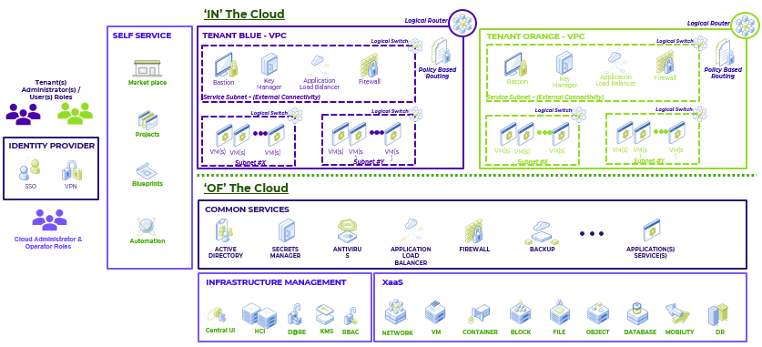
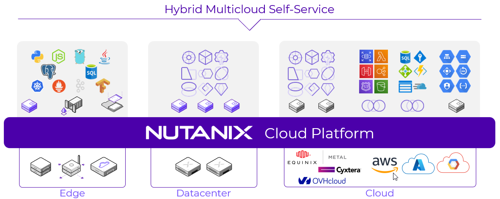

# Overview

NCM Self Service (Formerly Calm) provides advanced application-level orchestration that transforms
how IT teams manage applications and support the business. Fully
integrated into the Nutanix platform, NCM Self Service delivers a powerful, common
management framework that can be simultaneously leveraged by multiple IT
teams to rapidly create and deliver applications.

This picture shows a logical cloud architecture which is platform agnostic.  AWS Public Cloud is an example where
the following services are available for developer consumption.  Nutanix uses the logical cloud architecture to bring the
following services across hybrid/multi-clouds providers. 
 
- EC2 or VM as a service
- ECS or Container as a service
- EKS or Kubernetes as a service
- EFS or File as a service
- S3 or Object as a service
- RDS or Database as a service
- VPC or Virtual Private Cloud as a service

NCM Self Service allows IT to expose the underlying infrastructure across multiple
clouds as services the development and the business team can consume
easily.

## Takeaways

NCM Self Service Native Capabilities:

-   **Application Lifecycle Management:** Fully automate the provisioning, scaling, and deletion of both traditional multi-tiered
    applications and modern distributed services using pre-integrated blueprints that make management of applications in private and
    public clouds extremely simple.
-   **Customizable Blueprints:** Simplify the set-up and management of custom enterprise applications by incorporating all elements of each
    app, including relevant VMs, configurations and related binaries, into an easy-to-use-blueprint that is managed by the infrastructure
    team. IT teams can eliminate the hours and days currently devoted to routine application management.
-   **Nutanix Marketplace:** Blueprints can be published directly to end users through the Nutanix Marketplace, giving application owners and
    developers the ability to request IT services that can then be instantly provisioned.
-   **Governance:** NCM Self Service maintains control with role-based governance that limits user operations based on permissions. Additionally, all
    activities and changes are centrally logged for end-to-end traceability, aiding security teams with key compliance initiatives.
-   **Hybrid Cloud Management:** Automate the provisioning of Hybrid Cloud architectures, scaling both multi-tiered and distributed
    applications across different cloud environments, including AWS. NCM Self Service shows the overall utilization and true cost of your public
    cloud consumption at a glance so that decisions are based on business needs and budget requirements.
